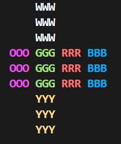

# Rubik's Cube Solver

This project implements Kociemba's Two-Phase Algorithm to solve a 3x3 Rubik's Cube in C++.

## Features

- Efficient cube representation 
- Basic cube moves (U, D, L, R, F, B, inverses and 2 )

